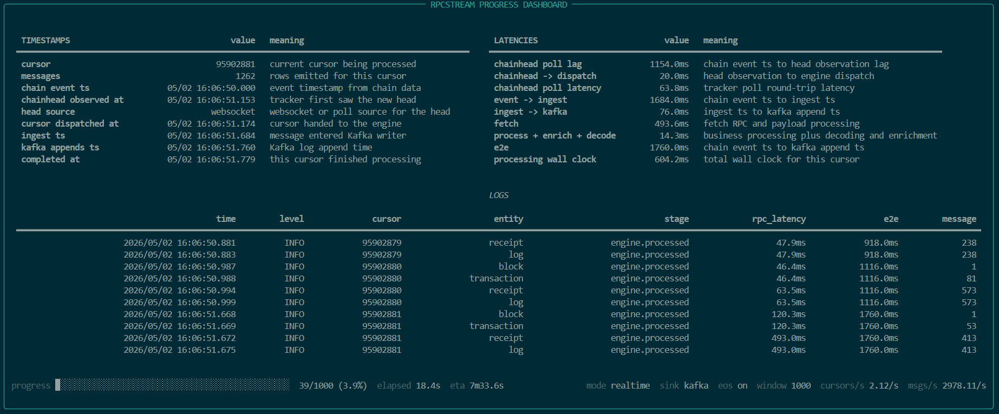

# Chainlake Flow

Chainlake Flow is a blockchain ingestion runtime built around `rpcstream`.
It supports:

- realtime streaming from chainhead or from saved progress
- bounded historical backfill
- Kafka delivery with optional EOS
- DLQ retry and replay
- EVM entity parsing and enrichment

The current primary target is low-latency blockchain ingestion over RPC, without requiring self-hosted archive nodes.

## Status

Current implementation is centered on:

- EVM chains
- Kafka as the sink
- Protobuf + Schema Registry
- `commit_watermark` and `cursor_state` based recovery

Planned or partial work exists for additional chains and sinks, but the README below reflects the current runnable system.

## Install

From the repository root:

```bash
uv pip install -e .
```

Or with the project virtualenv:

```bash
source .venv/bin/activate
pip install -e .
```

After editable install, the main entrypoint is:

```bash
rpcstream
```

## Configuration

The single default runtime config lives at:

[pipeline.yaml](pipeline.yaml)

By default, `rpcstream` looks for `pipeline.yaml` in the current working directory.

Typical local usage is therefore:

```bash
cd chainlake-flow
rpcstream
```

If you run from another directory, pass the config explicitly:

```bash
rpcstream --config pipeline.yaml
```

Environment variables are loaded from the nearest `.env` discovered from the config path upward. For local environment switching, prefer one `pipeline.yaml` plus explicit env files loaded in the shell.

## CLI

The root command handles ingestion directly.

### Realtime from checkpoint

Resume from saved `commit_watermark` when present. If no checkpoint exists yet, start from the current chainhead.

```bash
rpcstream
```

Equivalent to:

```bash
rpcstream --from checkpoint
```

### Realtime from chainhead

Ignore saved progress and start from the current chainhead.

```bash
rpcstream --from chainhead
```

`--from latest` is still accepted as a compatibility alias, but `chainhead` is the canonical form.

### Realtime from a specific cursor

```bash
rpcstream --from 95000000 --entity block,transaction
```

### Bounded backfill

```bash
rpcstream --from 95000000 --to 95000100 --entity block,transaction
```

### Topic and schema initialization

```bash
rpcstream init
```

This is an optional environment-preparation step.
It creates the Kafka topics and pre-registers protobuf schemas from
`pipeline.yaml`, but ingestion does not depend on it.
`rpcstream` can still start without it because protobuf schemas are
auto-registered on first use.

### Benchmark dashboard

`rpcstream benchmark` runs the benchmark path and renders a live dashboard.
It shows:

- completion progress, ETA, and throughput
- cursor timestamps and chainhead observation details
- latency breakdown for fetch, process, enrich, decode, and end-to-end
- recent info-level logs from the run



```bash
rpcstream benchmark --mode backfill --sink blackhole --output-file benchmark.json
rpcstream benchmark --mode realtime --sink kafka
```


### DLQ workflows

```bash
rpcstream dlq retry
rpcstream dlq replay --entity trace --status pending --stage processor --max-records 5
```

### Config inspection

```bash
rpcstream config validate
rpcstream config print
```

## Pipeline semantics

`pipeline.yaml` describes:

- chain and network
- entities to ingest
- RPC endpoint and inflight settings
- Kafka connection and topic pattern
- protobuf and schema registry
- EOS settings
- telemetry

The runtime mode is inferred from `from` and `to`:

- `from: checkpoint` or `from: chainhead` or `from: <cursor>` with no `to`: realtime
- `from: <cursor>` with `to: <cursor>`: backfill

Example:

```yaml
pipeline:
  from: "checkpoint"

chain:
  name: "bsc"
  network: "mainnet"

entities:
  - "block"
  - "transaction"
```

## Kafka topics

For EVM, the runtime can produce topics such as:

- `evm.bsc.mainnet.raw_block`
- `evm.bsc.mainnet.enriched_transaction`
- `evm.bsc.mainnet.raw_log`
- `evm.bsc.mainnet.raw_trace`

Progress and recovery use:

- `evm.bsc.mainnet.commit_watermark`
- `evm.bsc.mainnet.cursor_state`
- `dlq.ingestion`

High-level meaning:

- `commit_watermark`: the last contiguous successfully committed cursor
- `cursor_state`: gap-only state used to explain and recover holes
- `dlq.ingestion`: failure records used for retry and replay

Detailed behavior is documented in:

[docs/watermark_recovery.md](docs/watermark_recovery.md)

## EOS and recovery

When Kafka EOS is enabled:

- business topic rows
- `cursor_state`
- `commit_watermark`

are committed transactionally.

When EOS is disabled, the same logical model is preserved, but commits are not atomic across topics.

The recovery rule is the same in both modes:

- the durable resume point is `commit_watermark`
- it only advances when all earlier cursors are contiguous and successful

## EVM entity model

Current EVM ingestion uses:

- internal entities under `rpcstream/adapters/evm/entities`
- parser + enrich stages
- final sink schema defined in `rpcstream/adapters/evm/schema.py`

Notable behaviors:

- `transaction` is emitted as `enriched_transaction`
- `receipt` is treated as an internal dependency and is not emitted as a final raw topic
- `log` and `trace` are enriched with block context

More detail:

[docs/pipeline.md](docs/pipeline.md)

## Repository layout

```text
chainlake-flow/
├── pipeline.yaml
├── docs/
├── tests/
├── scripts/
└── rpcstream/
    ├── adapters/
    ├── cli/
    ├── config/
    ├── ingestion/
    ├── planner/
    ├── runtime/
    ├── scheduler/
    ├── sinks/
    └── state/
```

## Useful docs

- [docs/README.md](docs/README.md)
- [docs/ingestion_flow.md](docs/ingestion_flow.md)
- [docs/watermark_recovery.md](docs/watermark_recovery.md)
- [docs/dlq.md](docs/dlq.md)
- [docs/async_rpc_scheduler.md](docs/async_rpc_scheduler.md)
- [docs/observability.md](docs/observability.md)

## Current focus

The project is currently optimized for:

- sub-second realtime ingestion latency
- low `ingestion_lag`
- deterministic recovery
- Kafka-native downstream integration

For BSC-style fast block intervals, the current architecture prioritizes stable realtime ingestion over maximum backfill throughput.
